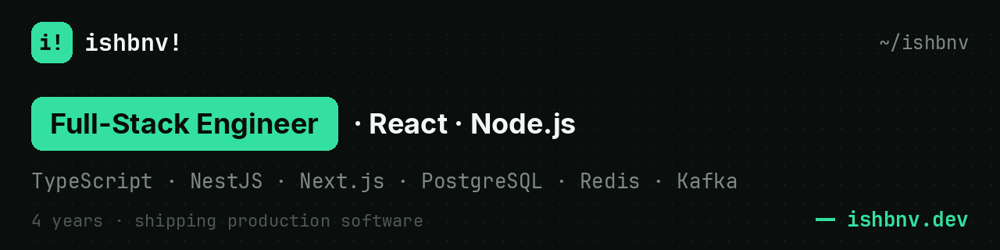

Full-stack engineer (TypeScript, React, Node.js). I ship features end-to-end: data model, API, UI, monitoring, production. Based in Yerevan, Armenia (GMT+4), full overlap with EU hours.

### What I've shipped

- Credit-report product in a VK chatbot for a consumer-lending fintech: led the feature, brought in a Python developer and an analyst, implemented the Node.js backend with score lookups across a 3M-row dataset. Channel net profit grew **40% within the first week**.
- Push-notification campaign builder (NestJS + React) that marketers run without engineers. Generates **~$75K/month**.
- Ad-traffic scoring: 100k-row table ingesting 9k+ leads a day, load time cut **from 5–8 s to under 1 s** with cursor pagination, Redis caching and row virtualization.
- The team's AI-assisted engineering workflow: Claude Code with project rules, custom MCP servers for the database, task tracker and docs, plus agentic pre-review. Routine work ships **~3× faster**.

### Stack

TypeScript · Node.js · NestJS · Express · React · Next.js · PostgreSQL · Redis · Kafka · Docker · GitLab CI/CD · OpenTelemetry · Grafana

### How I work with AI

I keep AI on a short leash: I design the architecture myself and take generated code apart by hand. Project rules, reusable skills and custom MCP servers handle the routine. Production is still on me.

### Links

[ishbnv.dev](https://ishbnv.dev) · [LinkedIn](https://www.linkedin.com/in/ishbnv/) · [CV (PDF)](https://ishbnv.dev/Ivan_Shabanov_CV.pdf) · ivan@ishbnv.dev
