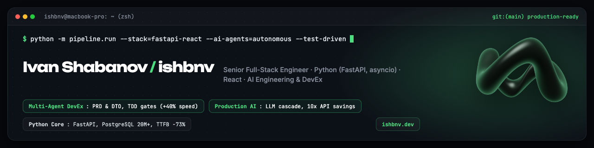

Senior Full-Stack Engineer specializing in **Python (FastAPI, asyncio)**, **React**, and **AI Engineering & DevEx**. I ship features end-to-end: system design, API contracts, database architecture, UI, and production observability. Based in Yerevan, Armenia (GMT+4), with full overlap with EU and US working hours. B2B contractor / EOR ready.

### What I've shipped

- **Credit-intelligence product for consumer-lending fintech (ID Finance)**: Led a 3-engineer cross-functional team to launch a scoring feature profitable in week one (net profit **+40%**, EPC from $1.9 to $3.8). Built asynchronous Python (FastAPI, asyncio) backend querying a **20M-row dataset** using composite PostgreSQL indexes and Redis.
- **Autonomous multi-agent engineering pipeline (ID Finance)**: Established an autonomous workflow of 5 context-isolated subagents with custom MCP servers, executable PRD/DTO contracts, and automated TDD Red/Green test loops. Feature turnaround dropped **from ~2 h to ~40 min (+40% delivery speed)** with 100% contract coverage.
- **Production LLM lead assistant (Admitad)**: Architected automated lead qualification service cutting response time **from ~8 min to <30 s**, with a 3-tier LLM model cascade reducing API costs **by 10×**; 3-month controlled trial moved the channel fully to AI, tripling monthly revenue from **$47K to $141K**.
- **Event-driven push engine & analytics (ID Finance & Appbooster)**: Engineered Apache Kafka streaming clickstream directly into an async FastAPI push engine with sub-second delivery (<500 ms) and zero message loss across ~10K daily events. Built 100K+ record reporting with cursor pagination and virtualization (load times cut **from 5–8 s to under 1 s**).

### Stack

Python (FastAPI, asyncio) · React · Next.js · TypeScript · PostgreSQL · Redis · Apache Kafka · Docker · Kubernetes · GitLab CI/CD · GitHub Actions · OpenTelemetry · Grafana · Claude Code · MCP

### How I work with AI

I treat AI as a deterministic force multiplier: I design system architecture and data contracts first, enforce strict TDD Red/Green test suites, and audit generated diffs through reviewer quality gates. Project rules, executable specs, and custom MCP servers eliminate routine so production stays rock-solid.

### Links

[ishbnv.dev](https://ishbnv.dev) · [LinkedIn](https://www.linkedin.com/in/ishbnv/) · [CV (PDF)](https://ishbnv.dev/Ivan_Shabanov_CV_en.pdf) · ivan@ishbnv.dev
